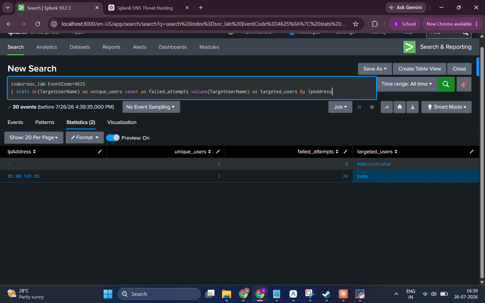
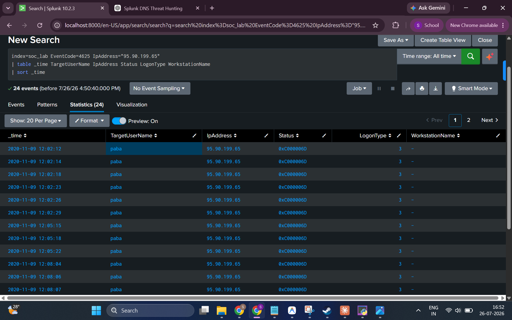
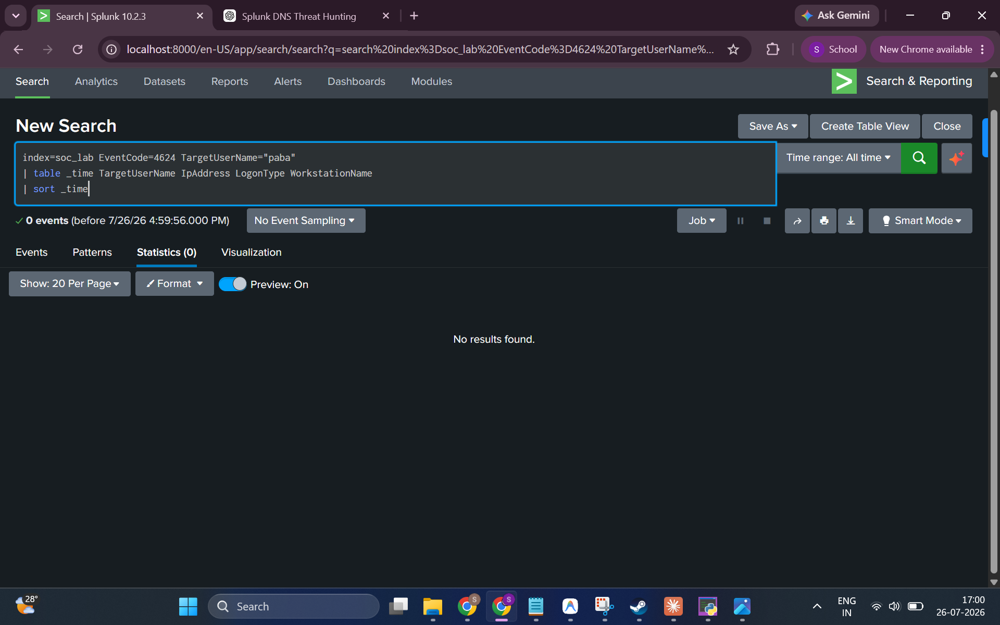
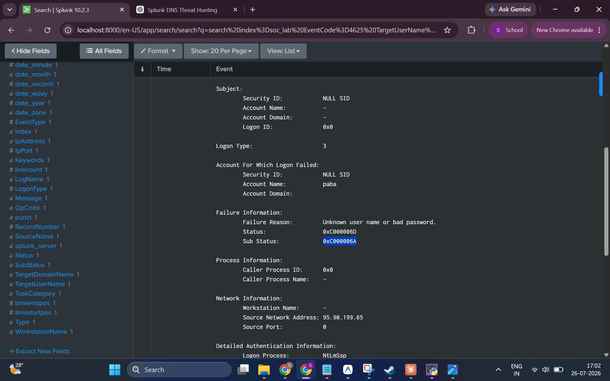
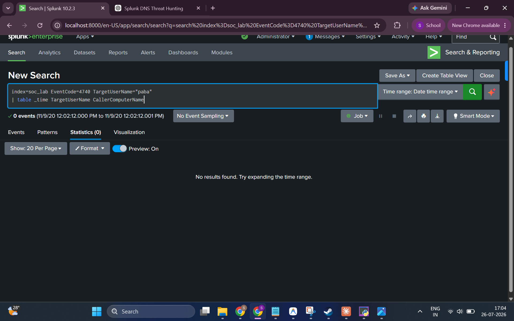

# 01 — Brute Force Investigation

**Hypothesis:** An external attacker is performing a brute force attack against domain user accounts, generating a high volume of failed logon events (EventCode 4625) from a single source IP.

**MITRE ATT&CK:** [T1110.001 — Brute Force: Password Guessing](https://attack.mitre.org/techniques/T1110/001/)

---

## Key Event Codes

| Event Code | Description |
|------------|-------------|
| **4625** | An account failed to log on |
| **4624** | An account was successfully logged on |
| **4740** | A user account was locked out |

---

## Investigation Steps

### Step 1 — Identify Source IPs with High Failed Logon Counts

The initial query aggregates all EventCode 4625 (failed logon) events, counting distinct targeted usernames and total failed attempts per source IP address. This distinguishes brute force (one IP, one user, many attempts) from password spraying (one IP, many users).

**SPL Query:**
```spl
index=soc_lab EventCode=4625
| stats dc(TargetUserName) as unique_users count as failed_attempts values(TargetUserName) as targeted_users by IpAddress
```

**Result:**



**Findings:**
- Two source IPs produced EventCode 4625 events
- IP `95.90.199.65` — **24 failed logon attempts** against a single user: `paba`
- Internal IP (`-`, no address recorded) — 6 failed attempts against `Administrator`
- Both IPs targeted only **1 unique user** each → consistent with brute force, not spraying

---

### Step 2 — Drill Down on Suspicious IP

Pivoting on `95.90.199.65` to see the full timeline of failed logon events:

**SPL Query:**
```spl
index=soc_lab EventCode=4625 IpAddress="95.90.199.65"
| table _time TargetUserName IpAddress Status LogonType WorkstationName
| sort _time
```

**Result:**



**Findings:**
- 24 failed logon events for user `paba` from `95.90.199.65`
- All events on **2020-11-09**, occurring in rapid bursts (seconds apart: 12:02:12, 12:02:14, 12:02:18…)
- **LogonType: 3** (Network logon — remote authentication attempt, typical of external brute force)
- **Status: 0xC000006D** (Bad username or authentication failure — the overall logon failure code)
- No workstation name recorded (consistent with external/remote attempt)

---

### Step 3 — Check for Successful Logon After Failures

After confirming brute force attempts, the next question is: **did it succeed?**

**SPL Query:**
```spl
index=soc_lab EventCode=4624 TargetUserName="paba"
| table _time TargetUserName IpAddress LogonType WorkstationName
| sort _time
```

**Result:**



**Findings:**
- **0 events returned** — No successful logon for user `paba` was recorded
- The brute force attempt did **not** result in a confirmed account compromise

---

### Step 4 — Examine Raw Event Detail

Inspecting the raw event payload for one of the 4625 events to extract all available forensic details:

**Result:**



**Key Fields from Raw Event:**
| Field | Value |
|-------|-------|
| Account Name | `paba` |
| Failure Reason | Unknown user name or bad password |
| Status | `0xC000006D` |
| Sub Status | `0xC000006A` (Wrong password — user exists, password incorrect) |
| Logon Type | `3` (Network) |
| Logon Process | `NtLmSsp` (NTLM authentication) |
| Source Network Address | `95.90.199.65` |

**Significance:** SubStatus `0xC000006A` confirms the **username `paba` is valid** (the account exists) but the password was wrong. This means the attacker correctly identified a valid account and was repeatedly guessing the password.

---

### Step 5 — Check for Account Lockout

A high volume of failed logons may trigger an account lockout (EventCode 4740):

**SPL Query:**
```spl
index=soc_lab EventCode=4740 TargetUserName="paba"
| table _time TargetUserName CallerComputerName
```

**Result:**



**Findings:**
- **0 events returned** — No account lockout was triggered for `paba`
- This suggests either the lockout policy threshold was not reached, or no lockout policy was configured for this account

---

## Conclusion

| Finding | Detail |
|---------|--------|
| **Attack Type** | Brute Force (Password Guessing) |
| **Source IP** | `95.90.199.65` (external) |
| **Target Account** | `paba` |
| **Failed Attempts** | 24 |
| **Logon Method** | NTLM, Network (LogonType 3) |
| **Account Valid?** | ✅ Yes (SubStatus 0xC000006A confirms account exists) |
| **Attack Successful?** | ❌ No confirmed successful logon |
| **Account Locked?** | ❌ No lockout event recorded |

**Evidence supports a brute force attack by an external IP against domain user `paba`. The attack was not successful — no EventCode 4624 (successful logon) was observed for this user, and no account lockout occurred.**

---

## MITRE ATT&CK

- **Tactic:** Credential Access
- **Technique:** T1110.001 — Brute Force: Password Guessing
- **Sub-technique:** NTLM network authentication (LogonType 3)
