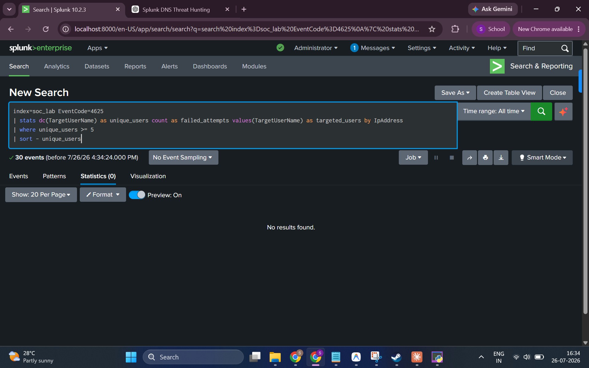

# 02 — Password Spraying Investigation

**Hypothesis:** An attacker is performing a password spraying attack — attempting one or a few common passwords against many different domain accounts — to avoid account lockouts while still attempting to gain access.

**MITRE ATT&CK:** [T1110.003 — Brute Force: Password Spraying](https://attack.mitre.org/techniques/T1110/003/)

---

## How Password Spraying Differs from Brute Force

| | Brute Force | Password Spraying |
|-|-------------|------------------|
| **Pattern** | Many passwords → one user | One/few passwords → many users |
| **Source IP** | Single IP, rapid attempts | Single IP (or distributed), slow attempts |
| **Lockout Risk** | High — hits lockout threshold | Low — stays under lockout threshold |
| **SPL Detection Signal** | High `count` per (IP, user) pair | High `dc(TargetUserName)` per IP |

---

## Key Event Codes

| Event Code | Description |
|------------|-------------|
| **4625** | An account failed to log on |

---

## Investigation Steps

### Step 1 — Query for IPs Targeting Multiple Unique Users

Password spraying is detected by identifying source IPs that have generated failed logon events (4625) against **5 or more distinct usernames**. The `where unique_users >= 5` filter is a common threshold used by SOC analysts to flag this pattern.

**SPL Query:**
```spl
index=soc_lab EventCode=4625
| stats dc(TargetUserName) as unique_users count as failed_attempts values(TargetUserName) as targeted_users by IpAddress
| where unique_users >= 5
| sort - unique_users
```

**Result:**



**Findings:**
- The query executed successfully and found **30 total EventCode 4625 events** in the dataset
- However, applying `where unique_users >= 5` returned **no results**
- No source IP in the dataset targeted 5 or more unique usernames

---

## Conclusion

**No evidence of password spraying was found in this dataset.**

The 30 total failed logon events in the index are concentrated against a small number of accounts (primarily `paba` and `Administrator`) from two source IPs. Neither IP targeted enough distinct user accounts to meet the password spraying detection threshold.

| Finding | Detail |
|---------|--------|
| **Total EventCode 4625 Events** | 30 |
| **IPs Meeting Spray Threshold (≥5 users)** | 0 |
| **Verdict** | ❌ No evidence of password spraying |

---

## Analyst Notes

The detection threshold of `unique_users >= 5` is configurable. In a real environment, the appropriate threshold depends on:
- The number of domain accounts (larger orgs may set higher thresholds)
- Whether distributed spraying is suspected (multiple IPs, each below threshold)
- The time window being analyzed (1 hour, 24 hours, etc.)

A lower threshold or time-windowed analysis (`bin _time span=1h`) could be applied for more sensitive detection in environments with fewer accounts.

---

## MITRE ATT&CK

- **Tactic:** Credential Access
- **Technique:** T1110.003 — Brute Force: Password Spraying
- **Result:** Hypothesis not supported by available log data
