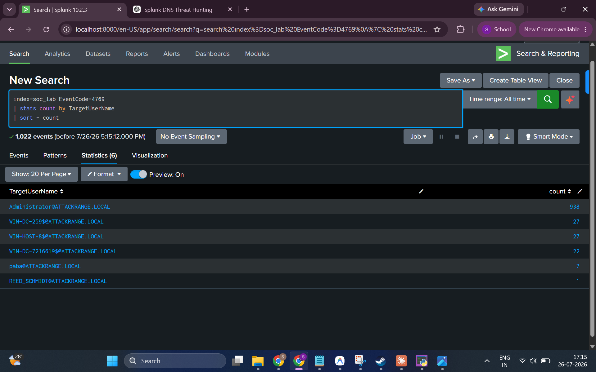
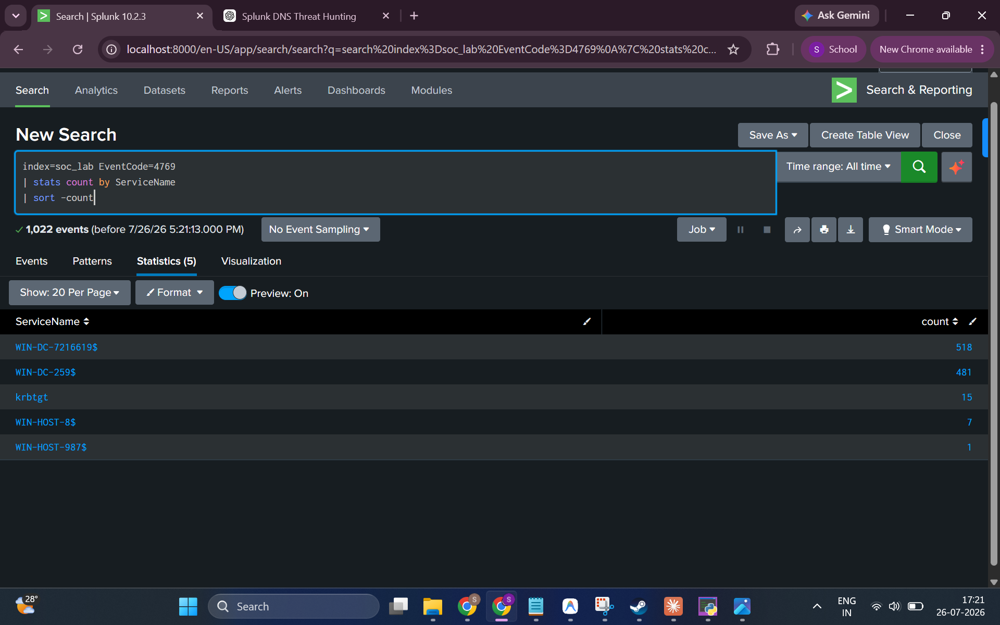
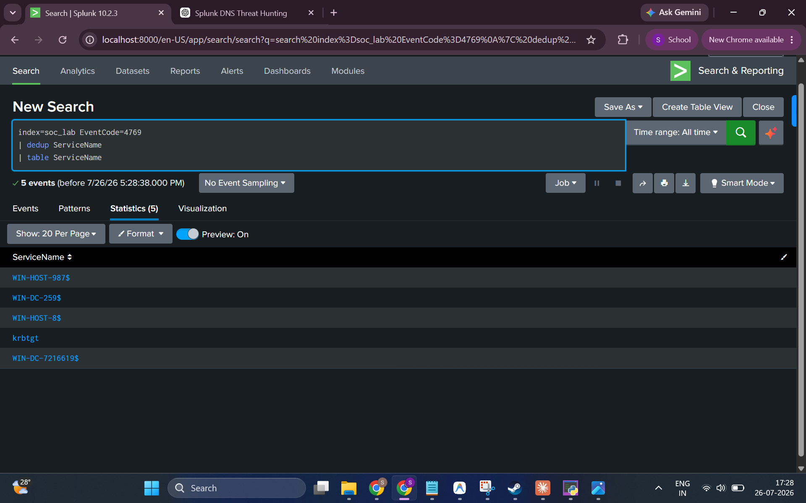

# 03 — Kerberoasting Investigation

**Hypothesis:** An attacker with domain user access is performing Kerberoasting — requesting Kerberos service tickets (TGS) for service accounts to extract them offline for password cracking.

**MITRE ATT&CK:** [T1558.003 — Steal or Forge Kerberos Tickets: Kerberoasting](https://attack.mitre.org/techniques/T1558/003/)

---

## Background: What is Kerberoasting?

In a Windows AD environment, any authenticated domain user can request a Kerberos TGS (Ticket-Granting Service) ticket for any registered service. These tickets are encrypted with the **service account's password hash**. Kerberoasting abuses this by:

1. Requesting TGS tickets for service accounts (especially those with weak passwords)
2. Extracting the encrypted ticket material offline
3. Cracking the ticket to recover the service account's plaintext password

**Windows logs TGS requests as EventCode 4769.** Kerberoasting indicators include:
- Unusually high volume of TGS requests from a single user
- TGS requests using RC4 encryption (TicketEncryptionType = 0x17) rather than AES
- Requests for non-machine service accounts (human-managed service accounts are higher value targets)

---

## Key Event Codes

| Event Code | Description |
|------------|-------------|
| **4769** | A Kerberos service ticket (TGS) was requested |

---

## Investigation Steps

### Step 1 — Volume of TGS Requests by Target User

First, understanding who is generating the most TGS requests:

**SPL Query:**
```spl
index=soc_lab EventCode=4769
| stats count by TargetUserName
| sort - count
```

**Result:**



**Findings:**
- **1,022 total TGS request events (EventCode 4769)** in the dataset
- `Administrator@ATTACKRANGE.LOCAL` — **938 requests** (overwhelming majority)
- Machine accounts (`WIN-DC-259$`, `WIN-HOST-8$`, `WIN-DC-7216619$`, etc.) — 22–27 each
- `paba@ATTACKRANGE.LOCAL` — 7 requests
- `REED_SCHMIDT@ATTACKRANGE.LOCAL` — 1 request

The high volume for `Administrator` is notable but may reflect legitimate operations on a Domain Controller.

---

### Step 2 — TGS Requests by Service Name

Identifying which services had their tickets requested — a critical pivot for Kerberoasting analysis:

**SPL Query:**
```spl
index=soc_lab EventCode=4769
| stats count by ServiceName
| sort -count
```

**Result:**



**Findings:**
| ServiceName | Count | Type |
|------------|-------|------|
| `WIN-DC-7216619$` | 518 | Machine account (Domain Controller) |
| `WIN-DC-259$` | 481 | Machine account (Domain Controller) |
| `krbtgt` | 15 | Kerberos TGT service — **high interest** |
| `WIN-HOST-8$` | 7 | Machine account (member server) |
| `WIN-HOST-987$` | 1 | Machine account |

**Key Observation:** The `krbtgt` service account was targeted 15 times. The `krbtgt` account's hash is used to forge Golden Tickets. TGS requests for `krbtgt` are highly suspicious outside of legitimate DC operations.

---

### Step 3 — Enumerate Unique Services Targeted

Confirming the total count of distinct service accounts that had TGS tickets requested:

**SPL Query:**
```spl
index=soc_lab EventCode=4769
| dedup ServiceName
| table ServiceName
```

**Result:**



**Findings:**
- **5 unique service names** had TGS tickets requested:
  1. `WIN-HOST-987$`
  2. `WIN-DC-259$`
  3. `WIN-HOST-8$`
  4. `krbtgt`
  5. `WIN-DC-7216619$`

All targeted services are **machine accounts** (ending in `$`) or the `krbtgt` service. There are no dedicated service accounts (e.g., `svc_sql`, `svc_web`) with potentially weak passwords — the primary target profile for classic Kerberoasting.

---

## Conclusion

**Inconclusive — TGS activity observed but classic Kerberoasting indicators are not confirmed.**

| Finding | Detail |
|---------|--------|
| **Total TGS Requests** | 1,022 |
| **Unique Services Targeted** | 5 |
| **High-Value Service Accounts** | None (all machine accounts or krbtgt) |
| **krbtgt TGS Requests** | 15 — **anomalous, warrants investigation** |
| **Encryption Type Analysis** | Not available in this dataset |
| **Classic Kerberoasting Verdict** | ❌ Not confirmed (no human-managed service accounts targeted) |
| **krbtgt Targeting** | ⚠️ Suspicious — may relate to Golden Ticket activity |

**The absence of human-managed service accounts in TGS requests means classic Kerberoasting (targeting weak service account passwords) cannot be confirmed. However, the 15 TGS requests for `krbtgt` are suspicious and may be a precursor to or artifact of Golden Ticket forging — see Investigation 05.**

---

## MITRE ATT&CK

- **Tactic:** Credential Access
- **Technique:** T1558.003 — Steal or Forge Kerberos Tickets: Kerberoasting
- **Result:** Hypothesis inconclusive for classic Kerberoasting; `krbtgt` activity suspicious
