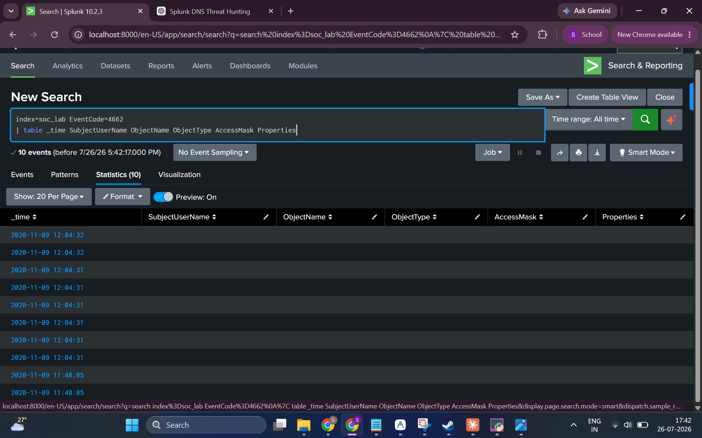
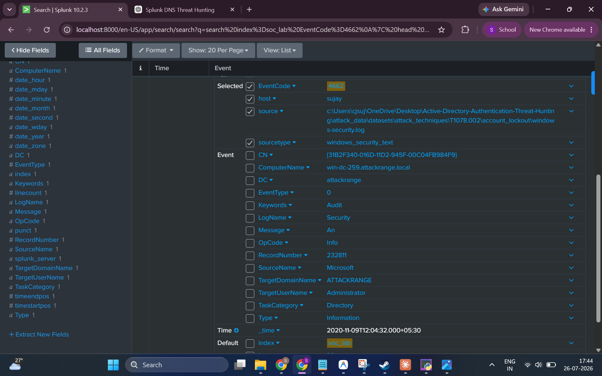
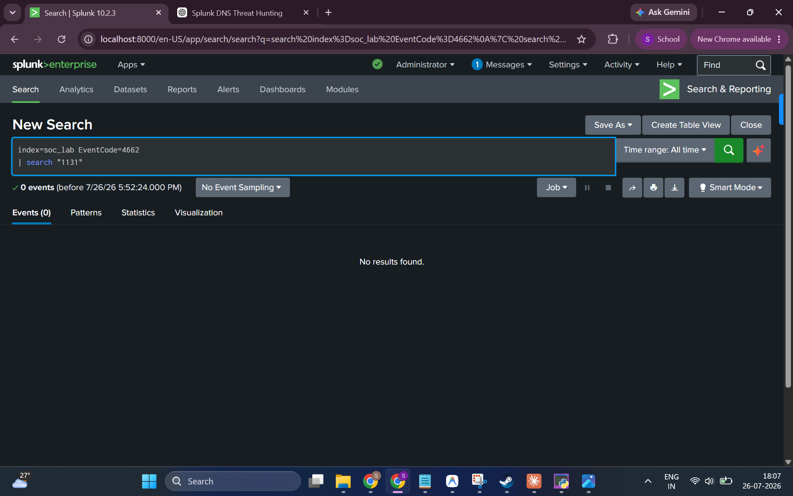

# 04 — DCSync Investigation

**Hypothesis:** An attacker with sufficient privileges is using a DCSync attack to impersonate a Domain Controller and request Active Directory replication, thereby extracting password hashes for all domain accounts without logging onto the DC directly.

**MITRE ATT&CK:** [T1003.006 — OS Credential Dumping: DCSync](https://attack.mitre.org/techniques/T1003/006/)

---

## Background: What is DCSync?

DCSync abuses the **MS-DRSR (Directory Replication Service Remote Protocol)**, which is the legitimate mechanism Domain Controllers use to replicate AD data between each other. An attacker with `DS-Replication-Get-Changes-All` rights (held by Domain Admins, Enterprise Admins, and DCs by default) can:

1. Impersonate a Domain Controller
2. Request AD replication from a legitimate DC
3. Receive the password hashes of any domain account (including `krbtgt` and `Administrator`)

**Windows logs Directory Service object access as EventCode 4662.** DCSync specifically generates 4662 events with:
- `AccessMask` containing `0x100` (Control Access)
- `Properties` containing the GUIDs for DS-Replication-Get-Changes (`1131f6aa-...`) and DS-Replication-Get-Changes-All (`1131f6ad-...`)

---

## Key Event Codes

| Event Code | Description |
|------------|-------------|
| **4662** | An operation was performed on an object (Directory Service access) |

---

## Investigation Steps

### Step 1 — Query for Directory Service Access Events

Retrieving all EventCode 4662 events to understand what directory access occurred:

**SPL Query:**
```spl
index=soc_lab EventCode=4662
| table _time SubjectUserName ObjectName ObjectType AccessMask Properties
```

**Result:**



**Findings:**
- **10 EventCode 4662 events** found in the dataset
- Events cluster around two time windows: **2020-11-09 12:04:31** (8 events) and **2020-11-09 11:48:05** (2 events)
- The `SubjectUserName`, `ObjectName`, `AccessMask`, and `Properties` columns appear empty in the table view — these fields may not be properly extracted from this dataset

---

### Step 2 — Examine Raw Event Detail

Drilling into the raw event to inspect all available fields:

**Result:**



**Key Fields from Raw Event:**
| Field | Value |
|-------|-------|
| EventCode | `4662` |
| ComputerName | `win-dc-259.attackrange.local` |
| TargetDomainName | `ATTACKRANGE` |
| TargetUserName | `Administrator` |
| TaskCategory | `Directory` |
| LogName | `Security` |
| Source | Dataset path: `T1078.002\account_lockout\windows-security.log` |

**Critical Finding — Dataset Source Mismatch:**

The `source` field reveals these 4662 events came from the **T1078.002 (Valid Accounts / Account Lockout)** dataset, **not** from the T1003.006 (DCSync) dataset. This means these EventCode 4662 events are a byproduct of account lockout activity, not DCSync replication operations.

---

### Step 3 — Search for DCSync-Specific Replication Rights Access

DCSync generates 4662 events containing specific replication right GUIDs in the `Properties` field. Searching for the core DCSync indicator:

**SPL Query:**
```spl
index=soc_lab EventCode=4662
| search "1131"
```

*(The string "1131" is the prefix of both DS-Replication-Get-Changes GUIDs: `1131f6aa-...` and `1131f6ad-...`)*

**Result:**



**Findings:**
- **0 events returned**
- No EventCode 4662 events contain the replication-related GUID strings
- This confirms that the 4662 events in the dataset are **not DCSync replication events**

---

## Conclusion

**No evidence of a DCSync attack was found in this dataset.**

| Finding | Detail |
|---------|--------|
| **EventCode 4662 Events Found** | 10 |
| **Source Dataset** | T1078.002 (Account Lockout) — not DCSync |
| **Replication GUIDs Present** | ❌ No (`1131f6aa`, `1131f6ad` not found) |
| **DCSync Access Mask (0x100)** | ❌ Not extractable from available data |
| **Verdict** | ❌ No confirmed DCSync activity |

**The EventCode 4662 events present in the dataset originate from account lockout activity (T1078.002), not from DCSync replication operations. The specific replication permission GUIDs that identify DCSync are absent from the dataset.**

---

## Analyst Notes

To properly detect DCSync, a complete analysis would require:
1. **EventCode 4662 events** with `Properties` containing:
   - `{1131f6aa-9c07-11d1-f79f-00c04fc2dcd2}` (DS-Replication-Get-Changes)
   - `{1131f6ad-9c07-11d1-f79f-00c04fc2dcd2}` (DS-Replication-Get-Changes-All)
2. Correlation with **EventCode 4624** for unexpected privileged logons to the DC
3. Ideally, **Microsoft Defender for Identity** (formerly ATP) alerts for DCSync, as Windows event logs alone can be insufficient

---

## MITRE ATT&CK

- **Tactic:** Credential Access
- **Technique:** T1003.006 — OS Credential Dumping: DCSync
- **Result:** Hypothesis not supported by available log data
