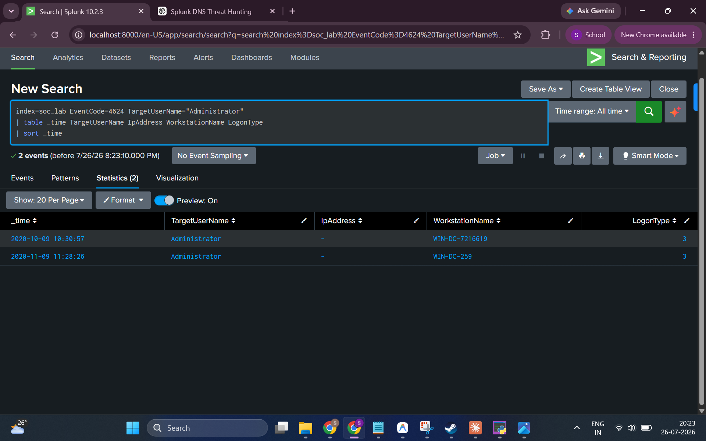
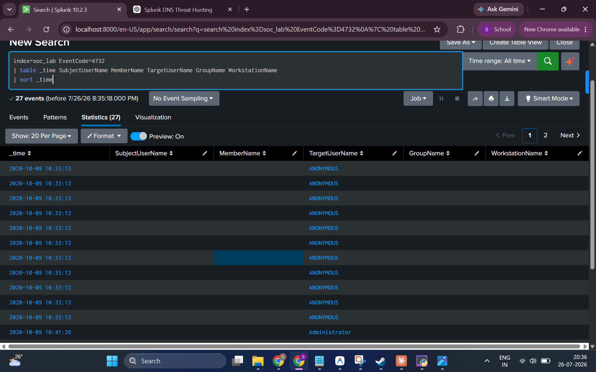
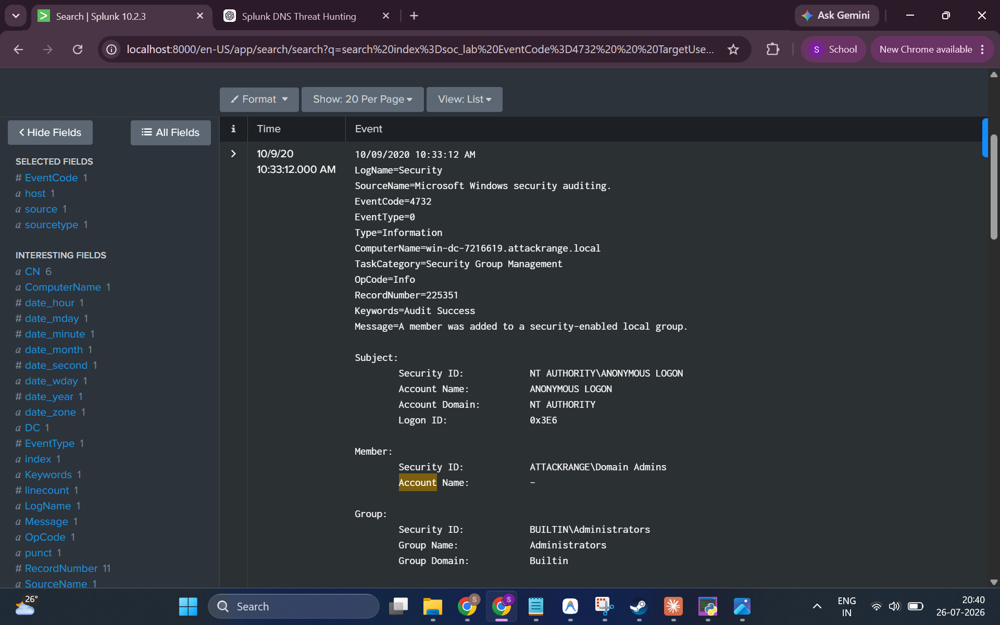

# 05 — Golden Ticket / Privilege Escalation Investigation

**Hypothesis:** An attacker has forged a Kerberos Golden Ticket using the `krbtgt` account hash, granting themselves persistent, unauthorized access to any resource in the domain as any user.

**MITRE ATT&CK:** [T1558.001 — Steal or Forge Kerberos Tickets: Golden Ticket](https://attack.mitre.org/techniques/T1558/001/)

---

## Background: What is a Golden Ticket?

A Golden Ticket is a forged Kerberos Ticket-Granting Ticket (TGT) signed with the `krbtgt` account's NTLM hash. Because all Kerberos authentication relies on the `krbtgt` key, an attacker who obtains this hash can:

1. Forge a TGT for **any user, including domain admins**, with any group memberships
2. Request TGS tickets for **any service** in the domain
3. Maintain access even after password resets, as long as the `krbtgt` password is not rotated

**Golden Ticket indicators in Windows event logs include:**
- EventCode 4624 with unusual logon patterns for privileged accounts
- EventCode 4768 with unusual TGT request metadata (RC4 encryption, non-standard fields)
- EventCode 4732/4728 — unexpected group membership changes, especially involving Domain Admins
- Logons occurring on machines where no interactive session should exist

---

## Key Event Codes

| Event Code | Description |
|------------|-------------|
| **4624** | An account was successfully logged on |
| **4732** | A member was added to a security-enabled local group |

---

## Investigation Steps

### Step 1 — Suspicious Logons for the Administrator Account

Reviewing all successful logon events (EventCode 4624) for the `Administrator` account to identify unusual access patterns:

**SPL Query:**
```spl
index=soc_lab EventCode=4624 TargetUserName="Administrator"
| table _time TargetUserName IpAddress WorkstationName LogonType
| sort _time
```

**Result:**



**Findings:**
| Time | WorkstationName | LogonType |
|------|----------------|-----------|
| 2020-10-09 10:30:57 | `WIN-DC-7216619` | 3 (Network) |
| 2020-11-09 11:28:26 | `WIN-DC-259` | 3 (Network) |

- Two successful Administrator logon events recorded
- Both are **LogonType 3 (Network logons)** — not interactive desktop sessions
- Both originate from Domain Controllers, which may be legitimate for DC-to-DC activity
- IP addresses are blank (`-`), which is unusual for network logons; legitimate DC-to-DC Kerberos traffic may not populate this field

---

### Step 2 — Investigate Group Membership Changes

One indicator of privilege escalation is unexpected additions to high-privilege groups. Querying for EventCode 4732 (member added to security-enabled local group):

**SPL Query:**
```spl
index=soc_lab EventCode=4732
| table _time SubjectUserName MemberName TargetUserName GroupName WorkstationName
| sort _time
```

**Result:**



**Findings:**
- **27 EventCode 4732 events** recorded
- Events begin on **2020-10-09 at 10:33:12** — the same day as the first suspicious Administrator logon
- Many events show `TargetUserName` as `ANONYMOUS` — which is highly unusual and warrants examination
- The `SubjectUserName`, `MemberName`, and `GroupName` columns require raw event inspection to interpret

---

### Step 3 — Examine Raw Event Detail for Group Membership Change

Drilling into the raw event payload to see exactly what group addition occurred:

**Result:**



**Key Fields from Raw Event:**
| Field | Value |
|-------|-------|
| EventCode | `4732` |
| Time | `10/09/2020 10:33:12 AM` |
| Message | "A member was added to a security-enabled local group" |
| Subject Security ID | `NT AUTHORITY\ANONYMOUS LOGON` |
| Subject Account Name | `ANONYMOUS LOGON` |
| Subject Account Domain | `NT AUTHORITY` |
| Member Security ID | `ATTACKRANGE\Domain Admins` |
| Group Name | `Administrators` |
| Group Domain | `Builtin` |
| Computer | `win-dc-7216619.attackrange.local` |

**This is highly anomalous.** This event records:
- The **Domain Admins group** being added as a member of the **local Administrators group** on `WIN-DC-7216619`
- The **subject performing this action is `NT AUTHORITY\ANONYMOUS LOGON`** — meaning no authenticated account identity was recorded for this change

---

## Conclusion

**Suspicious activity found — consistent with privilege escalation, potentially related to Golden Ticket use or other unauthorized privileged access.**

| Finding | Detail |
|---------|--------|
| **Suspicious Admin Logons** | 2 events (LogonType 3, DC-to-DC, blank IP) |
| **Group Membership Changes** | 27 EventCode 4732 events |
| **Subject of Group Changes** | `NT AUTHORITY\ANONYMOUS LOGON` — **highly anomalous** |
| **Group Modified** | `BUILTIN\Administrators` on `WIN-DC-7216619` |
| **Member Added** | `ATTACKRANGE\Domain Admins` |
| **Golden Ticket Confirmed?** | ❌ Not directly confirmed (no EventCode 4768 with Golden Ticket-specific fields) |
| **Suspicious Activity Verdict** | ⚠️ Yes — anonymous subject performing privilege escalation is a critical finding |

**The `NT AUTHORITY\ANONYMOUS LOGON` subject performing group membership modifications on a Domain Controller is a critical anomaly. In a real environment, this would immediately escalate to an Incident Response investigation. Combined with the TGS requests for `krbtgt` seen in Investigation 03, this activity is consistent with a Golden Ticket or other Kerberos-based attack enabling privilege escalation.**

---

## Analyst Notes

A complete Golden Ticket investigation would also examine:
- **EventCode 4768** — Kerberos TGT requests (check for RC4 encryption type `0x17` and non-standard fields)
- **EventCode 4769** — TGS requests following the suspicious Administrator logons
- **Timeline correlation** — The Oct 9 events (group changes + admin logon) versus the Nov 9 brute force against `paba` may represent a multi-stage attack scenario worth documenting

---

## MITRE ATT&CK

- **Tactic:** Privilege Escalation, Persistence, Lateral Movement
- **Technique:** T1558.001 — Steal or Forge Kerberos Tickets: Golden Ticket
- **Supporting Evidence:** EventCode 4732 with ANONYMOUS LOGON subject, krbtgt TGS requests (Investigation 03)
