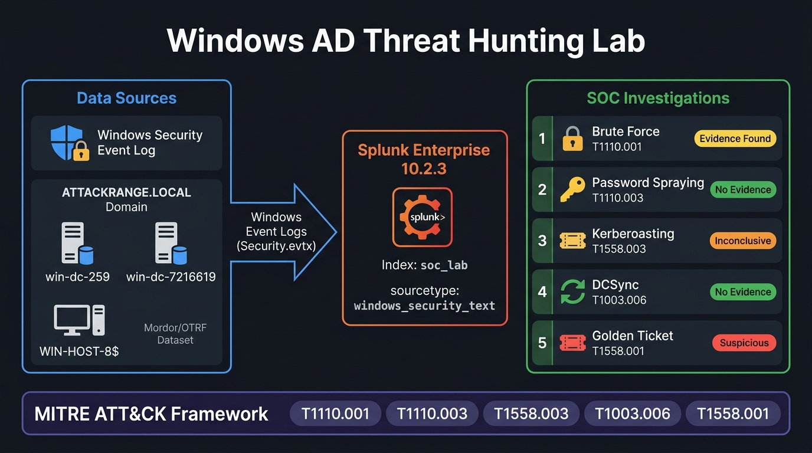

# Windows Active Directory Threat Hunting Lab

> **SOC Investigation Portfolio** — Threat hunting using Splunk SIEM against Windows Security Event Logs collected from an Active Directory environment.

---

## Lab Architecture



---

## Overview

This repository documents a structured threat hunting exercise conducted in a home lab environment. Windows Security Event Logs from an Active Directory domain (`ATTACKRANGE.LOCAL`) were ingested into **Splunk Enterprise** and analyzed using **SPL (Search Processing Language)** queries to investigate five common attack hypotheses.

The goal is to demonstrate a **SOC analyst investigation methodology** — forming a hypothesis, building targeted queries, interpreting results honestly, and reaching an evidence-based conclusion. Not every hypothesis resulted in a confirmed attack; that is by design. A good SOC analyst knows when the data supports a conclusion and when it does not.

---

## Environment

| Component | Details |
|-----------|---------|
| **SIEM** | Splunk Enterprise 10.2.3 |
| **Index** | `soc_lab` |
| **Log Source** | Windows Security Event Log (`windows_security_text`) |
| **Domain** | `ATTACKRANGE.LOCAL` |
| **Domain Controllers** | `win-dc-259.attackrange.local`, `win-dc-7216619.attackrange.local` |
| **Dataset** | Mordor/OTRF Attack Range datasets (simulated AD attack scenarios) |
| **Log Time Range** | October – November 2020 |

---

## Investigation Index

| # | Hypothesis | Key Event Codes | Conclusion |
|---|-----------|-----------------|------------|
| [01](./01-Brute-Force/README.md) | Brute Force Attack on Domain Account | 4625, 4624, 4740 | ⚠️ Evidence Found |
| [02](./02-Password-Spraying/README.md) | Password Spraying Attack | 4625 | ✅ No Evidence |
| [03](./03-Kerberoasting/README.md) | Kerberoasting (TGS Request Abuse) | 4769 | ⚠️ Inconclusive |
| [04](./04-DCSync/README.md) | DCSync Attack (Credential Dumping) | 4662 | ✅ No Confirmed Evidence |
| [05](./05-Golden-Ticket/README.md) | Golden Ticket / Privilege Escalation | 4624, 4732 | 🔴 Suspicious Activity Found |

---

## Key Windows Security Event Codes Referenced

| Event Code | Description |
|------------|-------------|
| **4624** | An account was successfully logged on |
| **4625** | An account failed to log on |
| **4740** | A user account was locked out |
| **4769** | A Kerberos service ticket (TGS) was requested |
| **4662** | An operation was performed on an object (Directory Service access) |
| **4732** | A member was added to a security-enabled local group |

---

## Skills Demonstrated

### 🔍 SIEM & Log Analysis
- **Splunk SPL** — writing multi-stage queries using `stats`, `eval`, `where`, `dedup`, `table`, `sort`, `search`, and time-based filtering
- **Windows Security Event Log** analysis — interpreting raw event XML fields, logon types, status/substatus codes, and authentication protocols
- **Field extraction & pivoting** — drilling from aggregated views into raw events for forensic detail
- **Index management** — understanding Splunk index structure, sourcetypes, and source field parsing

### 🛡️ Active Directory & Windows Authentication
- **Kerberos authentication flow** — TGT/TGS request lifecycle, encryption types (RC4 vs AES), and how Golden Tickets abuse the `krbtgt` hash
- **NTLM authentication** — NtLmSsp logon process, logon types (Type 2 = interactive, Type 3 = network), and failure status codes
- **Failure status codes** — interpreting `0xC000006D` (bad credentials), `0xC000006A` (wrong password, valid user), `0xC0000064` (user doesn't exist)
- **AD replication protocol (MS-DRSR)** — how DCSync abuses `DS-Replication-Get-Changes-All` rights and what EventCode 4662 properties identify it
- **Group membership events** — interpreting EventCode 4732/4728 for privilege escalation indicators

### 🎯 Threat Hunting Methodology
- **Hypothesis-driven hunting** — forming a testable hypothesis before writing a single query
- **Baseline vs. anomaly thinking** — understanding what normal looks like (e.g., DC-to-DC Kerberos) before flagging anomalies
- **Evidence-based conclusions** — documenting what the data supports and clearly stating when a hypothesis is not confirmed
- **Attack differentiation** — distinguishing brute force (one IP → one user) from password spraying (one IP → many users) using `dc()` aggregations
- **Multi-stage investigation** — pivoting from broad overview queries → narrow drill-down queries → raw event inspection

### 🗺️ MITRE ATT&CK Framework
- Mapping observed log patterns to ATT&CK techniques and sub-techniques
- Understanding the difference between tactic (goal) and technique (method)
- Documenting negative findings against ATT&CK — recognizing when data does not support a technique

### 📋 SOC Reporting & Documentation
- Writing structured investigation reports with hypothesis, queries, results, and conclusions
- Documenting negative findings transparently — a critical real-world SOC skill
- Presenting technical findings in a format readable by both technical and non-technical audiences

---

## Methodology

Each investigation follows this workflow:

```
Hypothesis
    ↓
Identify Relevant Event Codes
    ↓
Write SPL Query
    ↓
Analyze Results
    ↓
Drill Down / Pivot
    ↓
Evidence-Based Conclusion
    ↓
MITRE ATT&CK Mapping
```

---

## MITRE ATT&CK Mapping

| Technique ID | Technique Name | Investigation |
|-------------|---------------|---------------|
| T1110.001 | Brute Force: Password Guessing | [01-Brute-Force](./01-Brute-Force/README.md) |
| T1110.003 | Brute Force: Password Spraying | [02-Password-Spraying](./02-Password-Spraying/README.md) |
| T1558.003 | Steal or Forge Kerberos Tickets: Kerberoasting | [03-Kerberoasting](./03-Kerberoasting/README.md) |
| T1003.006 | OS Credential Dumping: DCSync | [04-DCSync](./04-DCSync/README.md) |
| T1558.001 | Steal or Forge Kerberos Tickets: Golden Ticket | [05-Golden-Ticket](./05-Golden-Ticket/README.md) |

---

## Important Note on Results

This lab uses **publicly available simulated attack datasets** (Mordor/OTRF Attack Range). Some investigations returned no results because the specific attack technique's log artifacts were either not present in the dataset or required additional data sources not available in the current index. Where this is the case, it is documented transparently in each investigation's README.

---

*Repository by Sujay C J | Cybersecurity Portfolio*
